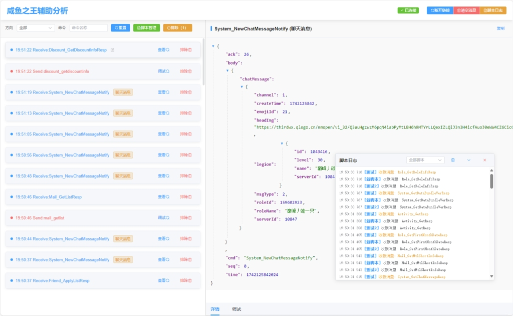

 

# 咸鱼之王辅助分析工具




## 项目简介

咸鱼之王辅助分析工具是一款专业的游戏全协议分析系统，旨在帮助用户全面掌握游戏通信数据。通过实时捕获和分析游戏中的网络协议，为游戏分析、开发和研究提供强大支持。

## 主要功能

### 全协议实时监控
- 实时捕获并分析游戏中的所有网络协议
- 全面掌握游戏数据流动情况

### 详细数据解析
- 自动解析JSON格式的游戏协议
- 展示完整的数据结构和内容

### 脚本管理系统
- 支持创建、编辑和管理多个分析脚本
- 满足不同协议分析的需求

### 协议备注功能
- 为每个协议添加自定义备注
- 方便后续查阅和分析

### 数据结构识别
- 自动识别并显示协议中的关键数据结构和字段
- 提高分析效率

### 自定义过滤器
- 根据需求筛选特定类型的协议
- 快速定位关键数据

## 技术特点

- 强大的脚本功能，内置智能脚本系统
- 用户友好的界面设计
- 高效的数据处理能力
- 灵活的自定义配置选项

## 使用示例


```javascript
// 这是一个示例脚本
// 处理游戏协议，将其内容作为参数
function processMessageData(messageData) {
    // 获取协议内容
    const cmd = messageData.cmd;
    if (cmd === "System_NewChatMessageNotify") {
        log("检测到聊天协议");
        return
    }
    
    log("游戏协议: " + cmd, "warning");
}
```

 

 

## 常见问题

**Q: 如何开始分析游戏协议?**  
A: 启动工具后，点击"开始监控"按钮，然后启动游戏即可自动捕获协议数据。

**Q: 如何创建自定义脚本?**  
A: 在脚本管理界面点击"新建脚本"，输入脚本名称和内容，然后保存即可。

**Q: 支持哪些游戏?**  
A: 理论上支持所有使用HTTP/HTTPS或WebSocket协议通信的网络游戏。

## 更新日志
## v1.0.5
fix 自定义消息后游戏无响应的bug
✨ feat(bon): 添加 EncodeReplaceResp 和 EncodeReplaceAck 方法  
✨ feat(bon): 新增 DecodeXAsMap 方法  
🐛 fix(proxy): 优化消息处理逻辑，支持 ack 和 resp 替换  
🔧 chore(handlers): 增加调试日志输出

### v1.0.0 (2025-03-16)
- 首次发布
- 实现基本的协议捕获和分析功能
- 添加脚本管理系统

## v1.0.3 (2025-03-16)
- 增加了一个简单的客户端程序，用于测试协议，方便测试协议是否正确。 （是脱机程序，协议分析还是下载Release的）
- 下载地址：https://zpoke.lanzouq.com/b011lbp6re 密码:81kf

## v1.0.4(2025-05-27)
- ✨ feat(crypto/bon): 新增序列号替换函数 EncodeReplaceSeq  
- 🔧 fix(api/handlers): 移除全局 sendSeq 改用 proxy.NextSeq()  
- ✨ feat(proxy/capture): 实现原子序列号生成及请求体序列号替换  
- ✅ test(crypto/bon): 添加 EncodeReplaceSeq 测试用例
 
 
